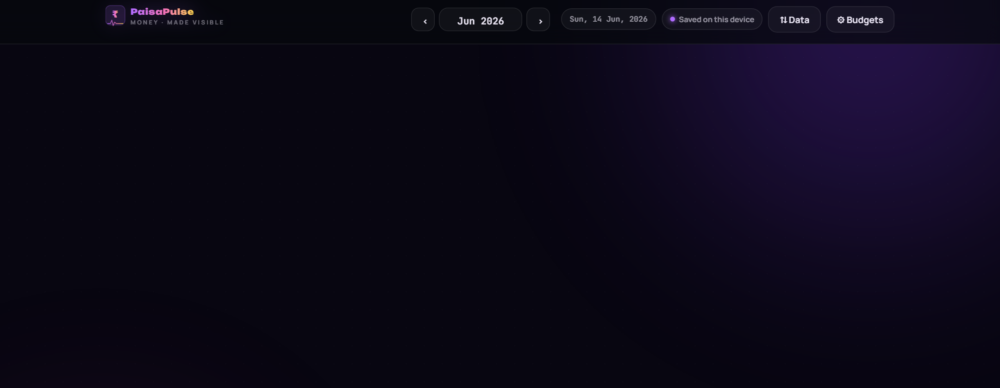
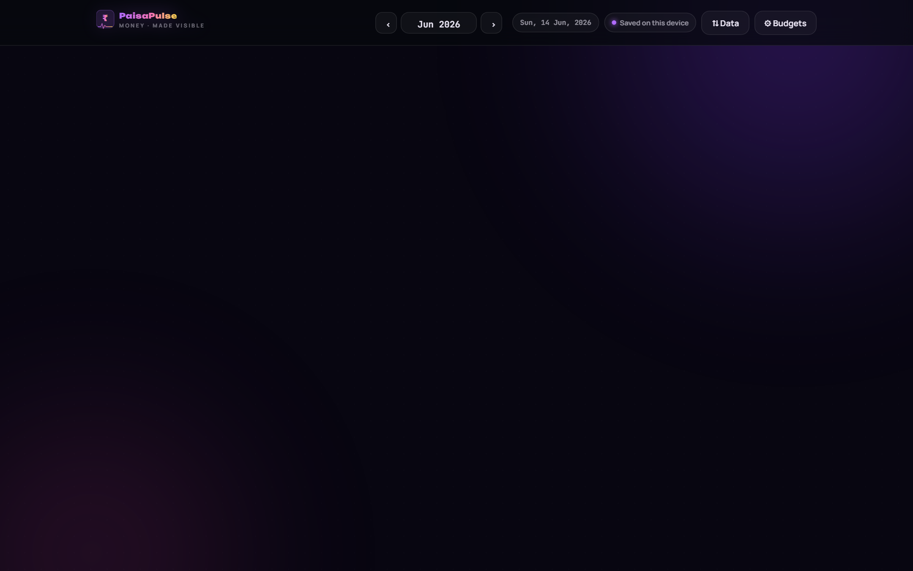

<div align="center">



# 💜 PaisaPulse

### *money, made visible*

**A beautiful, offline-first expense tracker that lives in one HTML file**  
**and stores your data in your own Google Sheet — no accounts, no servers, no ads.**

<br/>

[](LICENSE)
[](#)
[](#)
[](#)
[](#)

<br/>

[**⬇️ Download**](#️-how-to-use-it) · [**☁️ Connect Drive**](#️-make-your-data-permanent-recommended) · [**🛠️ Developer Docs**](#️-for-developers)

</div>

---

<div align="center">

## ✨ Everything at a glance



*Glowing dashboard · daily spend · running total · pace indicator · month-end projection*

</div>

---

## 🚀 Features

<table>
<tr>
<td width="50%" valign="top">

### 📊 Smart Dashboard
Daily spend, running total, daily average, month-end projection, and a **pace indicator** that warns you when you're drifting over budget — all in one glowing view.

### 🏷️ 15 Categories + Budgets
Per-category budgets, smart fuzzy search with IntelliSense-style suggestions, and a month-by-month analysis chart to spot patterns instantly.

### ⚡ Offline-First
Double-click `index.html` and it just works. **Zero setup, zero internet required.** Your data is saved on-device the moment you type it.

</td>
<td width="50%" valign="top">

### ☁️ Your Own Google Sheet
Optionally sync to a Google Sheet **in your own Drive** — no middleman, no subscriptions. A dead laptop never costs you your history.

### 🔒 100% Private
No hidden dependencies. No analytics. No network calls except to your own Sheet. The entire app is one readable HTML file you can audit in 30 seconds.

### 💫 Delightful Details
Time-aware greetings, a glowing cursor trail, entrance animations, keyboard shortcuts, and a calculator in the amount field.

</td>
</tr>
</table>

---

## 📸 Screenshots

<div align="center">

| Smart Search | Monthly Chart |
|:---:|:---:|
|  |  |

| Budget Tracker | Transaction History |
|:---:|:---:|
|  |  |

</div>

---

## ⬇️ How to use it

> **Takes under 2 minutes. No install needed.**

```
1.  Click the green  <>Code  button above → Download ZIP
2.  Unzip the folder
3.  Double-click  index.html  — it opens in your browser
4.  Start adding expenses  ✓
```

> **One tap away?** On desktop, drag the tab to your bookmarks bar. On mobile, open the file and tap **"Add to Home Screen"** for an app-like experience.

---

## ☁️ Make your data permanent *(recommended)*

Local storage is instant, but if your laptop dies the local copy goes with it. Connect to a **Google Sheet in your own Drive** to keep your history safe forever.

The app walks you through every step — but here's the overview:

```
1.  Open the app  →  ⇅ Data  →  Connect Google Drive  →  "I'm new"
2.  Create a blank Google Sheet  (the button opens sheets.new)
3.  In the Sheet:  Extensions → Apps Script  → paste the script → Save
4.  Deploy → New deployment → Web app
      Execute as: Me  |  Who has access: Anyone  → Deploy → Authorize
5.  Copy the /exec URL → paste into the app → Connect  ✓
```

**Switching devices later?**  
Open the app → **⇅ Data → "I already have a PaisaPulse Sheet"** → paste the same URL → all your data syncs back.

---

## 🔒 Is this safe?

<table>
<tr><td>✅</td><td><strong>Nobody but you sees your data.</strong> It lives in your browser and your Google Sheet, in your Google Drive. No server in the middle.</td></tr>
<tr><td>✅</td><td><strong>The app is one readable HTML file.</strong> No hidden dependencies, no analytics, no network calls except to your own Sheet.</td></tr>
<tr><td>✅</td><td><strong>The Apps Script runs as you, on your Sheet only.</strong> Setting access to "Anyone" makes the URL <em>reachable</em> — it does <strong>not</strong> make your Sheet public or visible to anyone without your secret URL.</td></tr>
<tr><td>✅</td><td><strong>Google Apps Script is an official Google product</strong> built exactly for this — turning your own Sheet into a private web app. Personal expense tracking uses a tiny fraction of the free quotas.</td></tr>
</table>

---

## ⌨️ Keyboard Shortcuts

| Shortcut | Action |
|:---:|:---|
| `Ctrl + J` | Jump to Amount field |
| `Ctrl + K` | Jump to Date field |
| `Ctrl + L` | Jump to Category search |
| `Ctrl + ;` | Jump to Note field |
| `Alt + 1` – `9` | Pick category by number |
| `Enter` | Add expense (from any field) |
| `←` / `→` | Previous / next month |

---

## 🛠️ For Developers

The project separates source from distributable — edit in `src/`, ship `index.html`.

```
paisapulse/
├── index.html          ← the distributable (built from src/)
├── build.py            ← bundles src/ → index.html
├── apps-script.gs      ← Google Apps Script backend
└── src/
    ├── index.html      ← HTML skeleton (open directly for dev)
    ├── css/
    │   └── styles.css
    └── js/
        ├── config.js       constants, CATS, keys, pure helpers
        ├── storage.js      StorageAdapter (localStorage / memory)
        ├── calculator.js   eval, parse, CSV import
        ├── cloud.js        CloudSync — outbox, flush, connect, firstSync
        ├── search.js       CategorySearch — fuzzy IntelliSense
        ├── chart.js        Chart — daily & monthly views
        ├── renderer.js     Renderer — all DOM updates
        ├── effects.js      cursor trail + entrance animations
        ├── keyboard.js     KeyboardHandler
        ├── ui.js           UI — toast, modals, onboarding, greeting
        └── app.js          PaisaPulse — owns state, wires everything
```

**Dev workflow:**

```bash
# Edit files in src/ — open src/index.html in browser to test live
# When ready to ship:
python build.py      # produces index.html (the distributable)
```

**Stack:** Vanilla HTML / CSS / JS — no build tools, no npm, no dependencies.  
Storage: `localStorage` + optional Google Apps Script + Google Sheets backend.

---

<div align="center">

Made with 💜 by [Prasun](https://github.com/theprasunbanerjee)

[MIT License](LICENSE) — do whatever you like with it. Free forever.

</div>
